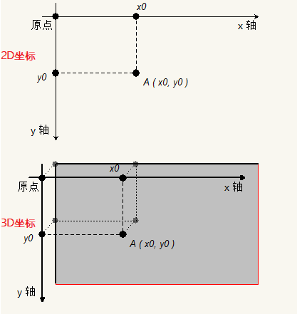

# Canvas

## Canvas 简介

  > Canvas是什么?

    Canvas(画布)是HTML5的一个新特性。传统的网页，总是使用GIF或者JPEG来显示图像，这种图形是需要事先画好，“静态”的图像；随着各种要求的发展，使用Flash或Java的“动态”图像也出现了。而Canvas，则是不使用Flash和Java，而是用Javascript在浏览器上绘图的一种手段。
    我们要用的Canvas其实是HTML文档中的一个元素,而我们所要学习的其实是HTML5赋予Canvas这个标签(元素)的一系列js方法.

  > Canvas的应用领域--数据可视化工程师

    1.游戏
    2.数据可视化 http://echarts.baidu.com/ --重点  数据可视化
    3.banner广告 youtube
    4.Canvas结合text, images, videos, 和 audio 产生高效而具有吸引力的用户体验。

  > Canvas效果展示

    1.知乎登录注册页动态离子背景效果
    2.表白时间
    3.坦克大战
    4.酷炫的演示文稿 http://www.axeslide.com/

  > 学习目标

    1.学会使用基本的canvas API,使用canvas可以完成简单的绘图
    2.实现数据可视化(折线图 饼状图)

  > Canvas 准备工作

    1.使用canvas标签,即可在页面中开辟一块区域,可以设置其width和height属性以设置该区域的大小
    2.默认canvas的宽高为300和150
    3.不要使用css的方式设置宽高,应该使用html属性
    4.如果浏览器不支持canvas标签,那么就会将其解释为div标签,因此常常在canvas中嵌入文本,以提示用户浏览器去升级
    5.canvas的兼容性非常强,只要支持该标签的,基本功能都一样,因此不用考虑兼容问题.
    6.canvas本身不能绘图,是使用javascript来完成绘图的,canvas对象提供了各种绘图用的API;

  ```html
    <canvas width="600" height="600"> 您的浏览器版本不支持canvas,请升级您的浏览器</canvas>
  ```

## 坐标系的方向与位置计算方法

  

    1.二维直角坐标系 以左上角为(0,0)点,X轴的正方向向右,Y轴的正方向向下

## 绘制的基本步骤

  > 1.布置画布:添加canvas元素

  ```html
    <canvas width="600" height="400"> 您的浏览器版本不支持Canvas,请升级您的浏览器</canvas>
  ```
  > 2.获取画布:获得canvas对象

  ```javascript
    var canvas = document.querySelector("canvas");
  ```
  > 3.获得画笔(2D环境):通过canvas对象的getContext("2d")方法，获得2D环境

  ```javascript
    var context = canvas.getContext('2d');
  ```

## 绘制一条线段

  > 1.确定画笔要在画布上的哪一个位置开始画

  ```javascript
    context.moveTo(X,Y);
  ```

  > 2.使用画直线的方法,并确定直线的结束点

  ```javascript
    context.lineTo(X,Y);
  ```

## 设置线的样式

  > 设置线宽

    context.lineWidth = value (value为number类型的值,1 2 3 4等)

  > 设置颜色

    context.strokeStyle = value (value为颜色)

  > 设置线末端类型

    context.lineCap = value (value可以为 butt(默认) round(圆角) square(方角))

  > 设置相交线的拐点

    context.lineJoin = value (value可以为 miter(默认) round(圆角) bevel)

## 绘制一个矩形块(有填充颜色的)

  > 设置填充

    context.fill()

## 开启路径与关闭路径

  > 开启路径

    context.beginPath();  不是什么时候都用开启新路径的  而是要绘制不同的样式的样式的时候 才需要开启新路径
    开启新路径是为了具体的设置不同图案的样式

  > 关闭路径

    关闭路径：指的时将同一个路径中的起点与终点相连接
    context.closePath();

## 绘制矩形

  > 绘制矩形

    context.rect( x, y, width, height );

  > 描边矩形

    context.strokeRect( x, y, width, height )

  > 填充矩形

    context.fillRect( x, y, width, height );

## 清空矩形(橡皮擦)

  > 清空矩形

    context.clearRect( x, y, width, height );

    在该区域创建了一个透明的矩形而已，不能填充颜色

## 绘制一条虚线

  > 绘制虚线

    context.setLineDash();参数类型 数组 如果数组的元素的个数为偶数 那么就代表 线段的长度和间隙的长度
    如果是奇数 那么就需要把数组里的元素复制一遍 让数组的元素的个数变成偶数